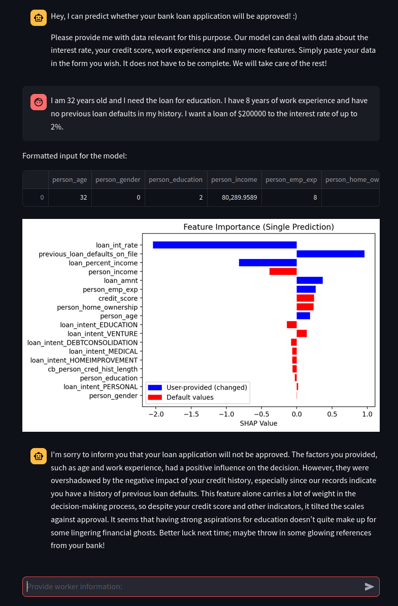

# Fortunate Loan

You want to find out whether the bank will approve your loan application? No big deal! Just provide (relevant) information about yourself in free text form to our Chatbot and it will deliver an answer with 90% accuracy.

But the key point is: The bot also provides explanations on the final decision based on **SHAP**!

## Quickstart

```streamlit run scripts/fortunate_gpt.py```

Each prompt represents a new loan request with no memory inbetween. 

Example prompts:

- "I am 18 years old and I need the loan for medicine. I have no previous loan defaults and 1 year of work experience." (--> negative result)
- "I am 55 years old and I have 30 years work experience. I have a pHd and an own house. I am married and I never had previous loan defaults. My interest rate is 1%. I earn 9999999 dollar per year. My credit score is 800" (--> positive result)
- "I am 36 months old. I need the loan for education and for medicine. I am neither male nor female." (--> conflicting data)



(Install the entries of `pip_libraries.txt` and `conda_libraries.txt` recursively if you have troubles with getting it to run)

Also make sure to provide your own openai API key.

No powerful GPU is required. The training was performed on an Intel CPU with Intel Iris Xe GPU acceleration.

## Overview

The most relevant files of this repository are the following:

- `data/loan_data.csv`: downloaded initial data
- `scripts/fortunate_training.py`: processes initial data to create `data/loan_data_preprocessed.csv` and train a model `models/fortunate_loan_model_gpu.plk`
- `scripts/fortunate_gpt.py`: the final application for the end user
- `scripts/fortunate_experiments.py`: more plots and analysis on SHAP itself including background info and theoretical explanations

## General concept


The user provides data which is then processed in a GPT request to create a JSON structure that can be extracted by the program to pass corresponding parameters to the loan model. The model performs a prediction. The result is then numerically explained with SHAP. These informations are then passed in another GPT request to be reformulated in natural language with an own interpretation of the situation. 

## Bugs

- Often the explanation states that a user failed to provide a feature value even though he did
- Sometimes GPT creates a JSON structure with wrong values from the user provided prompt data, also leading to flawed waterfall plots.

The instructions I gave to GPT in `scripts/fortunate_gpt.py` appear clear and complete to me though. I also don't want to switch to a model which costs more than gpt-4o-mini. 

## Potential future work

"If the user says he is 3 years old, it makes no sense to keep default annual income of 80 000 dollars." 

--> Instead of simply taking default values combined with user values, proceed differently: 
Step 1: Tell GPT to just return the JSON key-value pairs of keys that have user-provided values
Step 2: The program should compute new mean / default values for all other attributes based on user-provided values and the internal .csv database. 
Step 3: The resulting new dataframe is to be used for prediction.

## Misc (deprecated)

The original target application was a binary classification for water quality instead of loan approval.

However, the kaggle dataset https://www.kaggle.com/datasets/adityakadiwal/water-potability was bad (optimized accuracy of 67% while null accuracy was also above 60%). Therefore a different dataset was tried out: GRQA_data_v1.3.zip from https://zenodo.org/records/7056647 

The idea was then to take only files with site_country "Germany" and consider only german water values. One file in the .zip corresponds to one feature. Only relevant features should be considered for which quality standard ranges can be found online. The files from the dataset themselves do not contain a binary classification for potability. In most cases data newer than year 2000 is valid, but for COD and BOD 1990 is necessary. 

Since the classification for which numeric range of a certain feature water was still potable would have to be defined by myself, the training of a model makes no sense, because after the tolerable value ranges have been specified, a simple loop iteration with if-else checks would return the best solution. 

Thus, the topic was switched in order to gain actual benefit from machine learning which is the initial purpose of the project.

## Sources

- Loan dataset: https://www.kaggle.com/datasets/taweilo/loan-approval-classification-data 
- Model trained from scratch: https://xgboost.readthedocs.io/en/latest/python/python_api.html#xgboost.XGBClassifier
- SHAP analysis: https://shap.readthedocs.io/en/latest/example_notebooks/overviews/An%20introduction%20to%20explainable%20AI%20with%20Shapley%20values.html  
- Streamlit UI: https://docs.streamlit.io/develop/tutorials
- OpenAI Chat: https://platform.openai.com/docs/guides/text-generation

